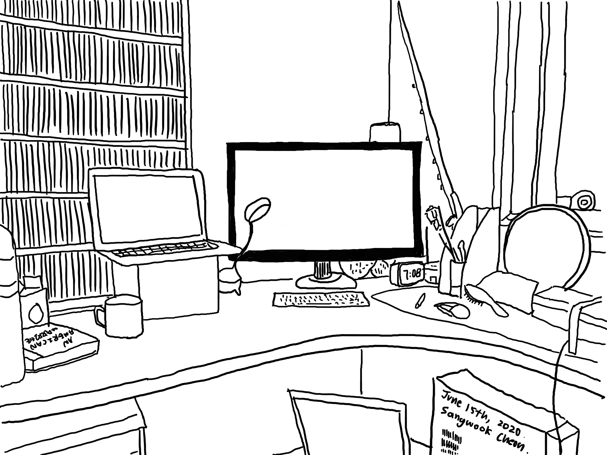

A few months ago, I noticed that the New York Times changed a lot after the birth of COVID-19. Every day, it shared films that we can binge-watch at home, along with new recipes, books, and even video games. This “At Home” section stayed on the front page along with the regular serious articles.

It was strange to me how a newspaper emphasizes that “not losing your mind” is important, telling me that distractions are necessary right now. It surely felt human, but I did not buy that idea. I would rather “enrich my mind” by using the hours at home to do something meaningful. My school switched entirely to online learning until the end of this school year, and I was sure that there would be myriad ways to diversify my indoor life.

<!--break-->

However, my goal to create meaning resulted in sitting in front of my computer all day long. Making music with my friends required a keyboard, GarageBand, and Adobe Premiere Pro. Working on Data Science projects meant researching online and crunching data with Atom. Running outside with a mask was the only outdoor activity.

Zero commute time gave me great flexibility in my schedule. It was not long ago when I minimized such “unproductive” time, listening to Ted Talks on the way to school and flipping over Hanzi Flashcards while returning. But I realized now that physically being in different settings has always ventilated my mind so that it can be filled with refreshing new tasks. Instead of enjoying the maximum productivity that I hoped for, I started looking into the recommendations by the New York Times.

I fulfilled the need to unwind here and there—ventilating my mind—with screen time again. Youtube, Netflix, iPad games, and more. They were like energy-boost drinks that have an immediate effect, and I didn’t need to move an inch to enjoy them. My desk had all I need.

*My workspace*

Only if these energy drinks were not addictive…

I quickly lost the sense of distinction between energy-boosts and productive work. Walking and working were two very different things before the virus, but everything now was under the broad category of “screen time.” After hours pass in any given day, it became too common for me to summarise what I have achieved. When I went through History in Google Chrome a week ago, the redness of Youtube and Netflix dominated the website list. The elegance of the New York Times logo and WaitButWhy faded. I even lost a sense of time.

I tried to justify my relationship with distractions every day. I am in the middle of a serious global pandemic, and as the New York Times said, let’s just not “lose my mind.” What else can I do? What else _should_ I do?

The dissatisfaction with myself grew daily as I tried to enlighten the day with an endless array of momentary entertainment. Distractions seemed to be almost paralyzing me, removing any space for my mind to wander. Does “not losing my mind” mean constantly distracting it? This feels wrong. Hell.

Thankfully, the New York Times woke me up. On its front page one day, I discovered [a powerful and moving article.](https://www.nytimes.com/2020/06/12/opinion/sunday/black-america-racism-refugee.html?action=click&module=Opinion&pgtype=Homepage) It was a personal reflection by Tiffanie Drayton, who fled the US due to unstoppable racism and the danger that black citizens face in the country. A mixture of emotions hit me as I visualized the heart-wrenching descriptions of protests and the ongoing attacks against black Americans.

Just as racism was “too much” for her to bear, the shame I felt about myself overwhelmed me. I did not know anything about George Floyd and the reasons why people are on the streets. I did not know how the “Black Lives Matter” movement sprung up. I had to google everything up because the author simply did not need to define these current events, knowing that it is already in the minds of millions. While these people were heroically calling for change, I was stuck in my room disconnected from the world, only plugged into irrelevant distractions.

A few months ago, I was like a newsboy. I closely followed the upcoming US Election, and I watched every single Democratic Debate from start to finish. I marveled at the endorsement of two candidates by the New York Times. I also watched Joe Biden going up and down, finally securing his place. The more I stayed away from current news, the more I became indifferent to the world.

Unwinding has become more important than ever during this stressful global crisis, but I believe that it should not numb our attention to the outside world. For a data science journalist, current events are sources of inspiration. Too often, distractions also interfere with the momentum of our goals and daily tasks. Writing is a stellar example because it requires us to spend time with sustained and focused effort, which can easily become daunting once distractions take over our minds. The need to think deeply becomes tedious, urging us to visit Youtube for short-and-sweet entertainment.

The more I am distracted, the less I am myself. Distractions are important to unload stress, but I indeed went too far.
