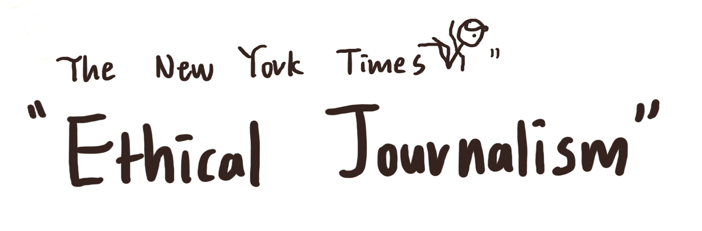
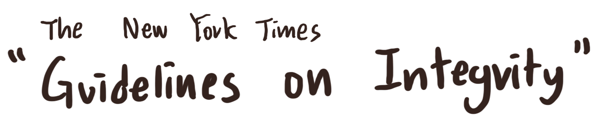

Today, I discovered a shocking news. It is not ‘breaking’ news, but I learn that a famous pop-science Youtuber got accused in 2019 for plagiarising when making his videos and submitting his own research paper. He also gained immense profits by making an interaction-based course (200 dollars to enter) that used outside sources without giving proper credit.

His main areas of interests are artificial intelligence, machine learning, and blockchain, and I used to admire his work. His Youtube videos were funny, focused, and fast-paced. He seemed to be a rockstar who is eager and confident to share all the knowledge he has.

# My Question and Concerns
This news made me wonder: How can I share my knowledge or research with the world with integrity? How can I avoid plaigiarism?

<!--break-->

But even when writing this article, I did not know if I am allowed to write the name of this YouTuber. Am I going to offend him in any way? As a student running a personal blog, are the boundaries of my writing different from the New York Times?

Because I am developing this blog every day, I felt strongly that writing well is not enough. Let’s use the [New York Times Ethical Journalism Handbook](https://www.nytimes.com/editorial-standards/ethical-journalism.html) to learn the standards of my favourite news outlet.

I also used its [“Guidelines on Integrity”](https://www.nytimes.com/editorial-standards/guidelines-on-integrity.html) to gain further insights.

----

Actually, much of the content in the Handbook regards to the relationship between the staff and the outside world, which includes news sources, people, and competitors. I, as an individual blogger, will focus mainly on “Open Source Investigations,” where Internet is the outside world. Therefore, it is important to summarise anything that deals with the use of online sources.

# “Participation in Public Life”

One powerful remark from the Times is that “journalists have no place on the playing fields of politics.” They should not do anything that might hint their political interests or views, such as donating for a specific candidate. Because journalists and politicians usually balance each other, I am thrilled to be a journalist who looks at societal problems. Op-Ed columnists enjoy a little bit more freedom because it is their job to express opinions. I want to be vocal, but at the same time, I want to maintain neutrality.

It is interesting how the Times has full-time “standards editors,” who ensures that no staff member goes outside the boundary set by the Handbook.

Here is the section that is repeated over and over:
> Those in doubt about contributions should consult their supervisors and the standards editor or the deputy editorial page editor.

It shows that I also should seek advice from adults, like my parents. I am a teenager after all, so it is important to clear out any ambiguities.

So far, I did not get much information on how to properly credit others when writing articles. The Handbook mainly focused on behavioural expectations. Perhaps the reason is that much of the content published by the Times is original, using the products of physical investigations. However, I see a lot of links within some articles, especially those that contain statistics, so I hope to understand why columnists do not include a “Works Cited” page. Let’s see if the “Guidelines on Integrity” page can help me out.

----

# Quotations
I should not clean up quotations. If I include quotes from online sources, the reader must be sure that the words between the quotation marks are **exactly** as they were written. The Times says that “approximate” quotations can “undermine readers’ trust” in the newspaper.

# Other People’s Reporting
When I use “facts gathered by any other organization,” I must attribute them. Unless I witness events myself or complete an original research, whenever I use an outside source, attribution is required.

My question is, is it enough to provide **links** to the sources? I am familiar with putting a ‘Works Cited’ section for all the essays I have completed in high school, but I do not know the standards in terms of writing articles. I never see this section in the articles of the Times. Columnists only put links. Does this method apply to me as well?

I hope to find this out soon.

# Corrections
As I have seen, the Times never arbitrary changes the article itself when there are errors or misinformation. It always puts a ‘Correction’ section at the top of the article, with a brief explanation and date. I will do this as well. If anything I write about is misleading, I will put up this section to maintain integrity and acknowledge my mistake. Simply altering the article will be viewed as an attempt to conceal it.

----

# Some Thoughts on Plagiarism
The two resources studied above did not talk about plagiarism. However, I think this topic is one of the most important ones I need to learn. Instead of writing an essay about it here, I want to express some brief thoughts.

A pop-science YouTuber, as mentioned before, made some of his videos using online sources without giving any credit that viewers can discover. He only changed grammar and a few words to avoid being labelled as “plagiarising,” sounding as if what he is saying is perfectly owned by him. When I was watching his videos, I thought he digested every concept so well that words simply comes out of his mouth naturally.

He wrote the names of authors he referred to only in an almost non-discoverable README file. The only explanation that makes sense to me is that he wanted to seem like an all-knowing educator. There is no doubt that his behaviors are inappropriate.

I must include visible citations whenever I include quotes or paraphrase information. When I summarise a research paper, it is absolute basics to include a proper MLA citation at the end of the article and include inline citations whenever necessary. I learned all these skills in Grade 9 and 10, so this should not be a problem.

Plagiarism can quickly undermine one’s reputation. It does not hurt to be careful.

# Conclusion

I love the idea that these Handbooks are read by every single staff member of the Times, as well as new employees just coming in. I admire the standards it set, and I am empowered to follow them when I am developing this blog. Although I am the only chief editor of my blog, the Internet should be treated with neutrality and integrity.

Next time, I want to check out the “New York Times Stylebook,” which I think will delve deeper into _how_ columnists write. But as of now, I am too eager to jump into researching and crunching data.
