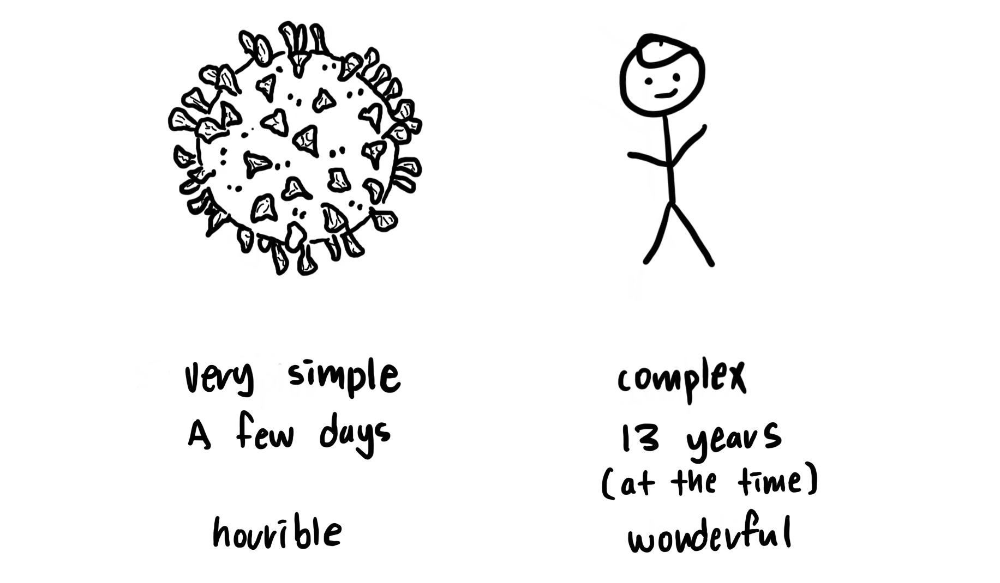

What is the first thing scientists did to tackle the rapidly-evolving COVID-19? 

They decoded the virus. It is often known as "genomic sequencing." After China shared the first cases with the world in late December, scientists gathered to identify the full sequence of the coronavirus. Researchers from France, Korea, and other nations followed suit soon after. 

<!--break-->

Genomic sequencing works as a foundational blueprint for scientists. The sequence is used as a reference when developing diagnostic tests and determining potential treatments. 
While the genomic sequence for COVID-19 quickly became a shared resource of the globe, such a process was more complicated a few decades ago, when the United States kickstarted an ambitious plan to decode a person. Yes, the "human" genome.

It is worthwhile to revisit the history behind the project that pushed us into the grand "era of the genome."

Following major technological advances in the 1970s, the notion of decoding a human got more feasible for scientists. Some critics assumed that functions of genes cannot be ever studied through their sequence, but a combination of potential scientific merit and public interest pushed the idea forward.

Department of Energy (DOE) and National Institute of Health (NIH) launched the "Human Genome Project" on October 1st, 1990, with the rough completion year of 2005. At the time, they did not expect that they will finish two entire years in advance.

Their big aim was to determine all genes and sequence nucleotides of the human genome, and also create databases to store information. But another important aspect was considering the philosophical and ethical issues, so roughly five percent of the budget was allocated towards this cause. Philosopher Eric T. Juengst was the director of this program. 

Instead of sequencing the genome right away, the team built genetic and physical "maps" first. In essence, DNA clones were replicated for sequencing, and polymorphic markers were used to target specific "chromosomal regions." Then, they tested genomic sequencing on smaller organisms before moving to the more complex human genome.

The task of sequencing the human genome stretched outside the US, where France and the United Kingdom funded their own research institutes. The Sanger Centre of the UK opened in 1993, which received support from the Wellcome Trust and Medical Research Council. Japan and China also jumped in soon after.

Besides, the team noticed a growing interest from the private sector in genome sequencing, such as the Celera Genomics. It proposed a distinctive way of sequencing, called the "whole-genome shotgun method," which breaks the entire genome with high-frequency sound waves into many smaller pieces of DNA, sequence them, and reassemble the sequences with supercomputers by mapping the clones to chromosomes. 

The public sector and Celera used different approaches, but they achieved the same result: sequencing roughly 3.2 billion base pairs. The US President Bill Clinton, DOE, and other scientists announced that the project has been completed in 2000, but the results actually had many gaps. Three years later, despite less public interest due to war and terrorism, the project officially came to a close.

Sequencing of the genome was truly an international effort. Six countries contributed 16 centers in total. Along the process, efficient methods of sequencing entire genomes were created and tested. Scientists were able to give partial credit to the initial assumption because the structure of the genome could provide limited insights into its function. Still, the project opened a new window of opportunities for the broad field of biology. 

It is curious to see if the Human Genome Project has provided equal opportunities for all parts of the world. How has the project accelerated medicine development, and is there any aspect that is left behind? If the publicity of the genomic sequence spurred innovation, what are the policies of the beneficiaries of the modern world?

Before I dive into these questions, I will write about the role of the sub-group that worked on the philosophical and ethical implications of the project. I hope to look at the visions they created and how they compare with the current society.

The Research Paper Used:

Gannett, Lisa, "The Human Genome Project", The Stanford Encyclopedia of Philosophy (Winter 2019 Edition), Edward N. Zalta (ed.).
